## Решение тестового задания для 'MStroy'
### Контактные данные
    Зайнуллин Айзат Маратович
    Тел: 89872674912
    ТГ: https://t.me/laneryel
    Почта: aizat9@list.ru

1) Собираем приложение и запускаем  
    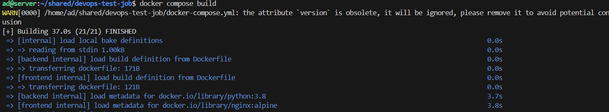
    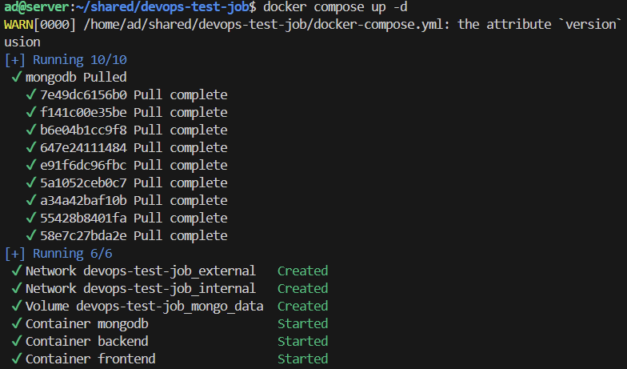

2) Видим, что контейнер фронтенда упал  
    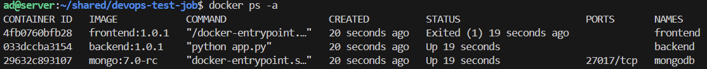

3) Смотрим логи, чтобы узнать в чем проблема   
    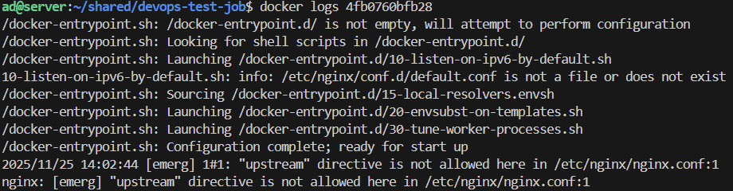  
    Что-то не так с блоком `upstream` в `nginx.conf`

4) Дополняем `nginx.conf` и пересобираем приложение  
    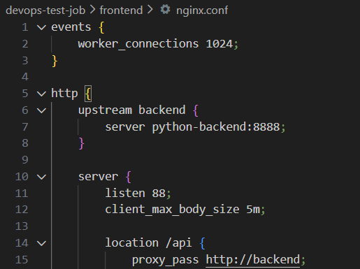

5) Снова контейнер упал, смотрим логи  
    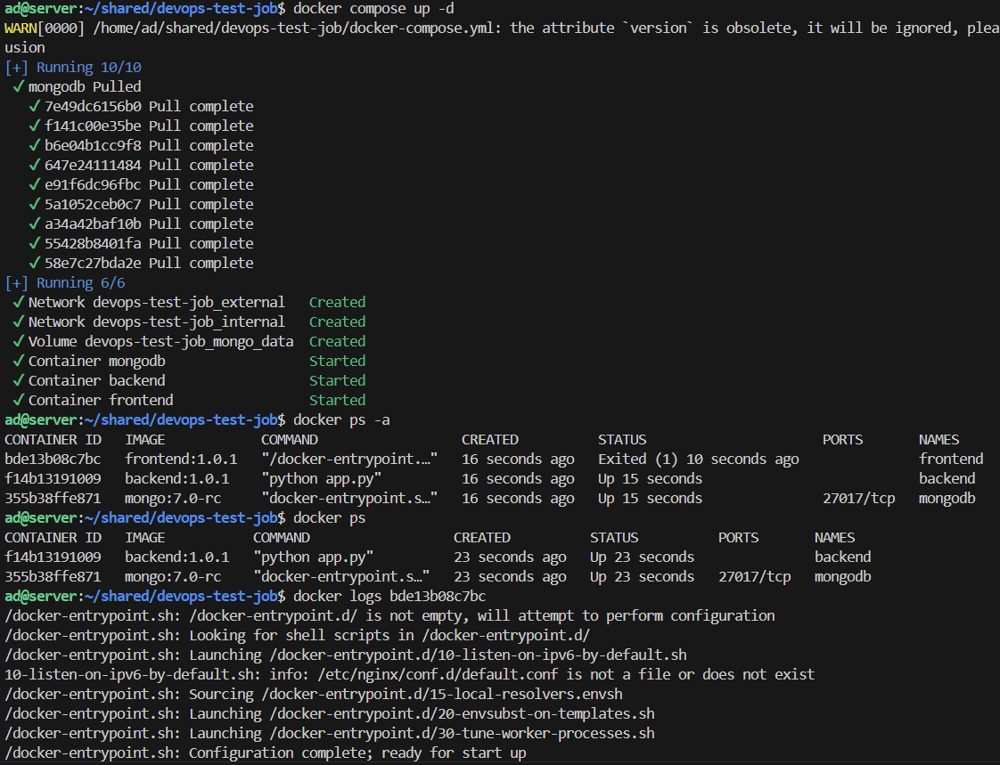    
    Хост `python-backend` не найден  

6) Снова корректируем `nginx.conf` согласно имени сервиса в `docker-compose.yaml` и пересобираем  
    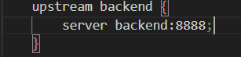  

7) Отлично. Все работает, но нет списка кошек, значит подключение к БД отсутствует  
    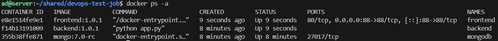  
    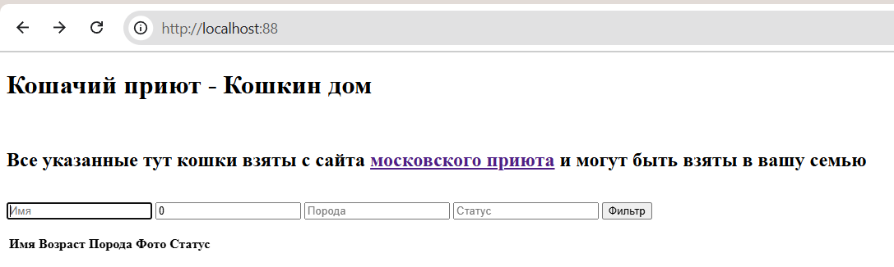  

8) Смотрим логи бэкенда, убедждаемся что подключение отсутствует  
    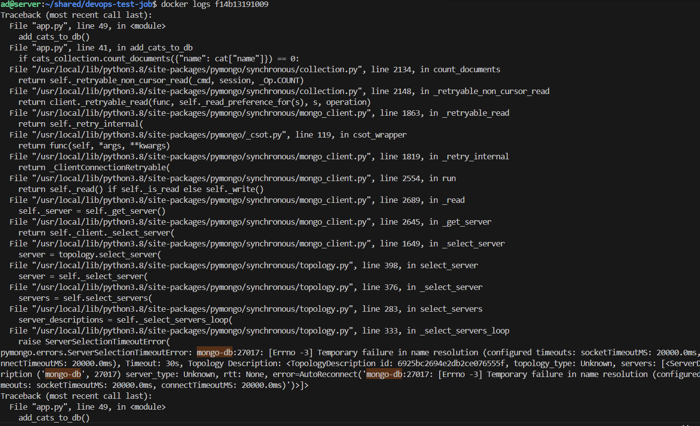  
    Не найден хост `mongo-db`

9) Корректируем `docker-compose.yaml`, меняя имя сервиса `mongodb --> mongo-db`  
    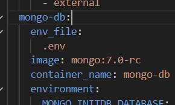  

10) Также корректируем сеть, подключая все сервисы к одной  
    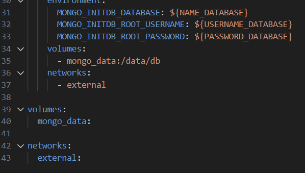

11) Плюс правильно прописываем путь в данной строке в файле `app.js`, т.к. nginx проксирует на 88 порт  
    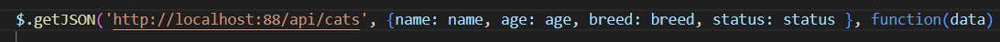  

12) Все работает  
    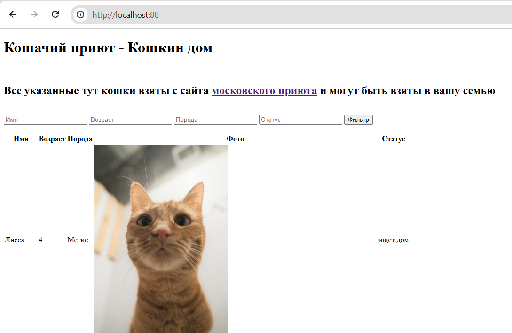
    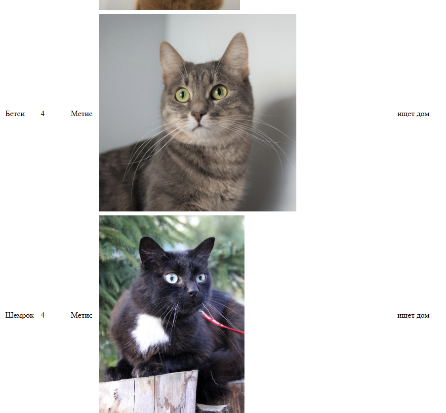
    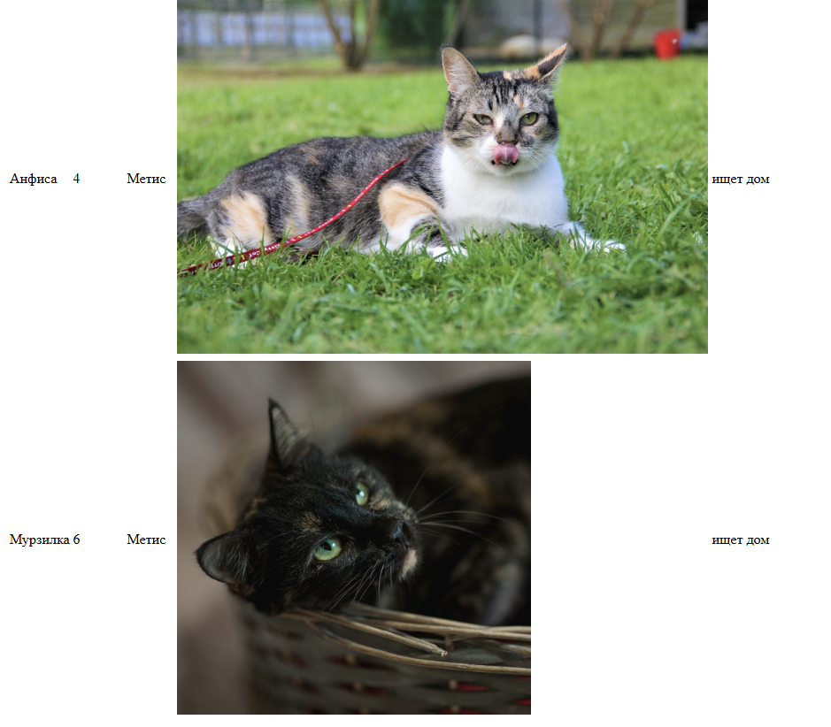